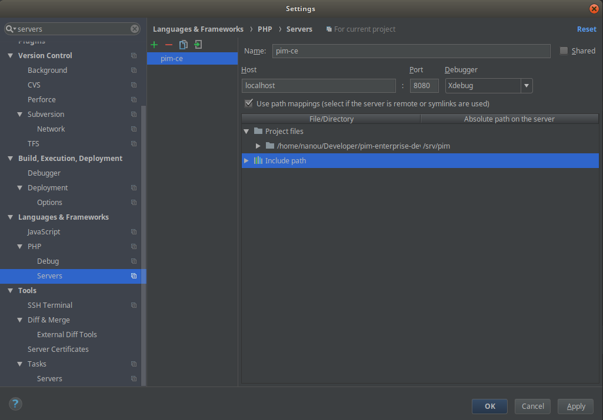
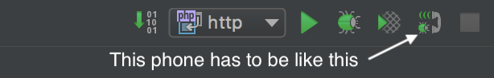
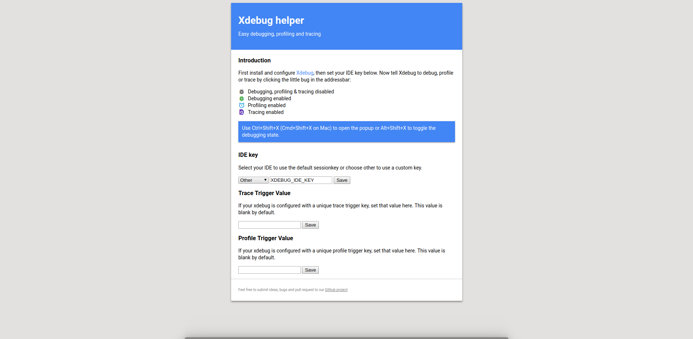

# Debugging

The content of this guide will help you to configure PHPStorm in order to debug a PHP Application.
The following documentation is tested with Linux, but might be easily adaptable for other host systems.

## Container config

*Xdebug* is deactivated by default. If you want to activate it, you need to set the following environment variables.

In this case we use a part of the default configuration of a php-fpm and httpd application but this is the same vein for other versions:
```yaml
services:
  fpm:
    image: akeneo/fpm:php-7.2
    environment:
      PHP_IDE_CONFIG: 'serverName=cli' # Your will need the server name for your IDE config
      PHP_XDEBUG_ENABLED: 1 # Set to 0 if you don't want to activate xdebug
      PHP_XDEBUG_IDE_KEY: 'XDEBUG_IDE_KEY' # the IDE KEY you want to use
      XDEBUG_CONFIG: 'client_host=xxx.xxx.xxx.xxx' # Your host IP address, useful for CLI debugging
    volumes:
      - ./:/srv/application

  http:
      image: httpd:2.4
      depends_on:
        - fpm
      environment:
        PHP_IDE_CONFIG: 'serverName=browser' # Your will need the server name for your IDE config
      ports:
        - '8080:80' # You will need the 8080 for your configuration
```

Then you just have to run `docker-compose up -d` again and XDebug will be activated.

## Tools Config

### PHPStorm

First of all, you have to setup your server. Go in PHPStorm ... `Settings > Servers` section, then add a new one, and configure it as above



You can see that:
- The server name is the same than `serverName` used in the compose file
- The host is `localhost`
- The port is the one which is accessible from your host (in the case of cli, the port to use is `80`)
- The absolute path on server mapping is the one that you configure in your server, here `/srv/application`

You will have to duplicate it for all your servers, in the case of a PHP installation with a CLI and a HTTP Server, you will have to setup
- cli
- http

Then, you have to setup the configuration of your debugger. You can find under the Menu `Run > Edit Configurations...`
Click on `+` and choose `PHP Remote Debug` and configure a remote debug like this


You can see that:
- You have to choose a name, we generally choose the same name than your server (here `http`)
- You have to check `Filter debug connection by IDE key`
- You have to select the corresponding server (here `http`)
- You have to enter the `IDE key (session_id)`, here the default one `XDEBUG_IDE_KEY`

Then, you have to enable XDebug in PHPStorm as you would do for any other PHP application.



### Google Chrome

You will have to download a plugin such as [xdebug helper](https://chrome.google.com/webstore/detail/xdebug-helper/eadndfjplgieldjbigjakmdgkmoaaaoc)

Configure it as follow:



You have to change the `IDE key` by `Other` and the key you have chosen (here `XDEBUG_IDE_KEY`)

